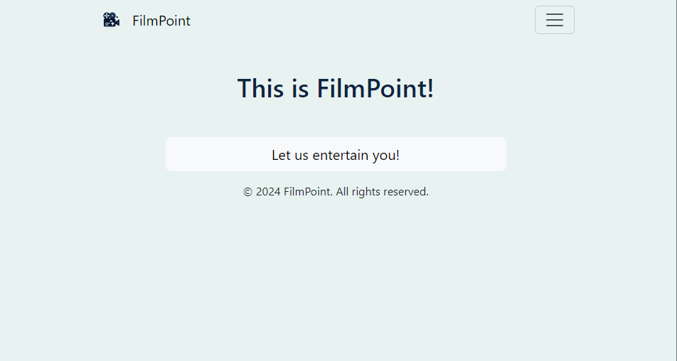

Filmpoint is a simple website for movie recommendation system for users.

Filmpoint takes the user to survey where questions are saved to database what forwards the answers to api to recommend
user movies.

## Installation and usage

1. Clone the repository.

2. Create virtual environment.

         cd path/to/your/project
         python -m venv venv
         venv\Scripts\activate #Windows
         source venv/bin/activate #macOS or Linux

3. Install requirements.txt.

         pip install -r requirements.txt

4. Add database.

5. Create .env file.

Example for MySQL:

      SECRET_KEY='django-insecure-s@xw=y+b7o@a4uk935bho9#(6k&9d96r*o^zbo9j4%abt2xhg9'
      DEBUG='True'
      DB_ENGINE='django.db.backends.mysql'
      DB_NAME='(database_name)'
      DB_USER='(your_username)'
      DB_PASSWORD='(your_password)'
      DB_HOST='localhost'
      DB_PORT='3306'

Example for PostgreSQL:

      SECRET_KEY='django-insecure-s@xw=y+b7o@a4uk935bho9#(6k&9d96r*o^zbo9j4%abt2xhg9'
      DEBUG='True'
      DB_ENGINE='django.db.backends.postgresql'
      DB_NAME='(database_name)'
      DB_USER='(your_username)'
      DB_PASSWORD='(your_password)'
      DB_HOST='localhost'
      DB_PORT='5433'

6. Migrate migrations files.

         python manage.py migrate

7. Create a superuser

       python manage.py createsuperuser

8. The project comes with the fixture file which holds pre-made data for quicker testing which can be applied.

         python manage.py loaddata fixtures.json

